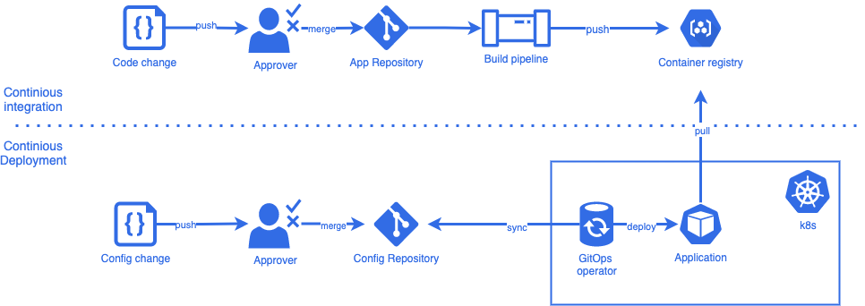

# GitOps Fundamentals Exercises
This repository contains exercises for the GitOps fundamentals training. Below you find some

## What is GitOps?
---

- Core idea: having a Git repository that contains declarative descriptions of the infrastructure currently desired.
- Automated process to match the desired state in the repository.

The promises:

- Deploy faster more often;
- Error recovery;
- Self-documenting deployments;
- Easier credentials management.

### Overview



### Flux


## Prerequisites
---

### Install software

- kubectl https://kubernetes.io/docs/tasks/tools/
- flux cli https://fluxcd.io/docs/installation/#install-the-flux-cli
- git https://git-scm.com/book/en/v2/Getting-Started-Installing-Git

### Other prerequisites

- A personal namespace provided by your trainer
- An instruction to download your kubeconfig file

### Configure kubeconfig
By default, kubectl looks for a file named config in the $HOME/.kube directory. You can specify other kubeconfig files by setting the KUBECONFIG environment variable or by setting the --kubeconfig flag. Make your life easier with the kubectl cheatsheet (https://kubernetes.io/docs/reference/kubectl/cheatsheet/)

1. Copy the content of your kubeconfig file and write to ~/.kube/config.
2. Test your connection with the following commands:

```
kubectl version
```

```
kubectl get pods -n <NAMESPACE>
```


### Fork or copy this repository
We are going to connect a Git Repository to Flux and use this repo to create, update and remove an application via git changes. It is possible to fork this repository under your personal user if you are using Github. It is also possible to use another Git repository like Gitlab or Bitbucket and copy the files to this repository. As long as you have your own repository with full access you should be fine.

## Exercises
---

### Source controller

* [Source controller](exercises/source-controller/)

### Kustomize controller

* [Kustomize controller](exercises/kustomize-controller/)

### Helm controller

* [Helm controller](exercises/helm-controller/)