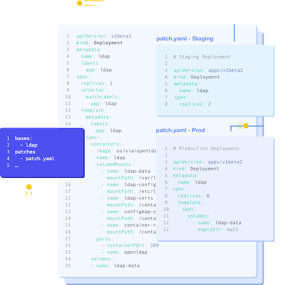

# Kustomize controller
Kustomize is a k8s configuration management solution that lets you customize and apply YAML files. It can be seen as an overlay engine. With Kustomize you can create a base configuration with the most common configuration of an application and use patches to apply settings that are specific for an environment. The example structure below illustrates an overlay structure. Suppose the only configuration difference between staging and production is the amount of replicas. All common configuration will be in the the base folder and the patch yaml files will only contain the correct amount of replicas.

```
├── base
│   ├── deployment.yaml
│   ├── kustomization.yaml
└── overlays
    ├── staging
    │   ├── patch.yaml
    │   ├── kustomization.yaml
    └── production
        ├── patch.yaml
        ├── kustomization.yaml
```


With the Flux Kustomize controller you are able to watch for Kustomization objects in a Git repository. Based on the Kustomization file it will build Kubernetes manifest files, validates the build output and applies them on the cluster. Whenever objects are removed from source it will remove them from the cluster as well keeping your cluster in sync with the repository.

# Exercises
1. Create a service account and the required RBAC so Flux is able to deploy resources in your namespace.
```
kubectl create serviceaccount flux-reconciler --dry-run=client -o yaml -n <NAMESPACE> > cluster/staging/flux-sa.yaml
```
```
kubectl create rolebinding flux-reconciler-admin-binding \
--clusterrole=admin \
--serviceaccount=<NAMESPACE>:flux-reconciler \
--dry-run=client \
-o yaml \
-n <NAMESPACE> \
> cluster/staging/flux-rbac.yaml
```
```
kubectl apply -f cluster/staging/flux-sa.yaml
```
```
kubectl apply -f cluster/staging/flux-rbac.yaml
```
2. Patch \<NAMESPACE> in the file exercises/kustomize-controller/staging/podinfo/kustomization.yaml with your own namespace.
3. Push these changes to git and reconcile your source so these changes will be available for Flux.
```
flux reconcile source git flux-fundamentals
```
4. Create a Kustomization for your rbac, serviceaccount and flux-fundamentals Git source yaml.
```
flux create kustomization cluster \
--service-account=flux-reconciler \
--source=flux-fundamentals \
--path="./cluster/staging" \
--prune=false \
--interval=10m
```
> With this Kustomization you make sure that the rbac, serviceaccount and Flux resources for the staging cluster are also stored in Git and will be applied by flux every 10m.

5. Create a Kustomization for your helm repositories.
```
flux create kustomization repositories \
--service-account=flux-reconciler \
--source=flux-fundamentals \
--path="./repositories" \
--prune=true \
--interval=10m
```
> With this Kustomization you make sure that the Helm repository sources are available within your cluster and will be stored in Git.

6. Create a Kustomization resource for your staging apps.
```
flux create kustomization kustomize-apps \
--service-account=flux-reconciler \
--source=flux-fundamentals \
--path="./exercises/kustomize-controller/staging" \
--prune=true \
--interval=10m
```
> With this Kustomization Flux will look for kustomization.yaml files in the given directory and will apply the constructed Kubernetes manifests. Every 10 minutes it will sync.

7. Export the Kustomizations as yaml and push to git.
```
flux export kustomization kustomize-apps > cluster/staging/flux-kustomize-apps-kustomization.yaml
```
```
flux export kustomization cluster > cluster/staging/flux-cluster-kustomization.yaml
```
```
flux export kustomization repositories > cluster/staging/flux-repositories-kustomization.yaml
```

8. Validate if there is a podinfo deployment in your namespace
```
kubectl get deployments -n <NAMESPACE>
```
9. Create a port-forward and validate in your browser (http://localhost:9898) if the application is running
```
kubectl port-forward svc/podinfo 9898 -n <NAMESPACE>
```
10. If you look at the base/podinfo/deployment.yaml you see that PODINFO_UI_COLOR has a different color code than the one that is applied at staging/podinfo/patch.yaml. Validate if the overlay is working correctly by comparing color #326ce5 with the one that is displayed in your browser.

11. In the base/podinfo/deployment.yaml file you can see that this application is configured with 1 replica. Figure out a way to apply a patch in the staging/podinfo/patch.yaml file so the amount of replicas will be 3.
> Be aware that you apply the setting with the same indentation as in the base.

12. (BONUS) Also add pod topologySpreadConstraints (https://kubernetes.io/docs/concepts/workloads/pods/pod-topology-spread-constraints/) to your deployment with topologyKey=topology.kubernetes.io/zone and maxSkew=1. With topologySpreadContraints you can control how Pods are spread among zones.

13. Push these changes to git and reconcile your Kustomization --with-source
```
flux reconcile kustomization kustomize-apps --with-source
```
14. Confirm you now have 3 replicas of the podinfo deployment.
```
kubectl get pods -n <NAMESPACE>
```
15. (BONUS) If you managed to configure topologySpreadConstraints. Confirm that your pods are evenly spread across zones.
```
kubectl get nodes --output=custom-columns="NAME:.metadata.name,ZONE:.metadata.labels.topology\.kubernetes\.io/zone"
```
```
kubectl get pods -o wide -n <NAMESPACE>
```
> You might need to scale and downscale your application to confirm that the pods are evenly spread (kubectl scale deployment podinfo -n \<NAMESPACE> --replicas \<REPLICAS> ). 

16. Now remove the staging/podinfo directory from your repo and push these changes to git.
17. Reconcile your Kustomization and confirm that Flux has removed your deployment because it has been removed from git.
```
flux reconcile kustomization kustomize-apps --with-source
```
```
kubectl get deployment -n <NAMESPACE>
```